<div align="center">

# 🔗 URL Shortener — DevSecOps Reference Architecture

**A full-stack URL shortener engineered as a live demonstration of secure, automated, production-grade CI/CD.**

The application is intentionally simple. The pipeline that ships it is not.

[](https://github.com/kamaljit87/url-shortner-app/actions/workflows/development.yml)
[](https://github.com/kamaljit87/url-shortner-app/actions/workflows/production.yml)


</div>

---

## 📐 Project Overview

This repository is a Node.js/Next.js URL shortener — but its real purpose is to serve as a working, inspectable reference for how a small team ships containerized software **safely**: every change is scanned for secrets, static vulnerabilities, dependency risk, and Dockerfile misconfiguration *before* an image is ever built, every built image is scanned again *before* it's pushed, and every deployment is health-checked and DAST-scanned *after* it goes live — all without a human touching the server.

**What it does:** users register, log in, and shorten URLs with optional custom aliases. Visiting a short link redirects and records a click. Standard CRUD, standard auth — deliberately unremarkable, so the pipeline is the focus.

**Why this architecture:**

| Decision | Reasoning |
|---|---|
| **Two long-lived environments (`development` / `main`), promoted via PR** | Mirrors how regulated and enterprise teams actually gate production — a human approves the merge, but everything gate-worthy (security scans, health checks, DAST) already ran automatically before that PR exists. |
| **Build once in dev, promote the *same* image to prod** | Rebuilding for production would mean deploying bytes that were never scanned or smoke-tested. Promoting the exact artifact eliminates "it worked in dev but not prod" caused by build-time drift (different base layer pulled, different dependency resolution, etc.). |
| **Dedicated reverse-proxy project, decoupled from the app stacks** | Nginx has a different lifecycle than the application — it shouldn't restart when the backend redeploys, and it needs to reach *multiple* app stacks (dev + prod) simultaneously. Splitting it into its own Compose project with its own network membership makes that possible. |
| **No database ever touches a public network** | The database only needs to talk to the backend. Giving it a network route to the internet-facing proxy — or a published host port — is attack surface with zero functional benefit. |
| **Immutable, content-addressable image tags (`YYYY.MM.DD-<shortsha>`)** | A tag must mean exactly one set of bytes, forever. `latest` and branch-name tags are mutable and make rollback and audit non-deterministic. |

---

## 🗺️ Architecture Diagram

```mermaid
flowchart TD
    Dev["👩‍💻 Developer"] -->|git push| GH["🐙 GitHub — development branch"]
    GH --> GA["⚙️ GitHub Actions Workflow"]

    subgraph SEC["🛡️ Security Gate — must pass before build"]
        direction LR
        S1["Gitleaks<br/>secret scanning"]
        S2["Semgrep<br/>SAST"]
        S3["Trivy FS<br/>dependency scan"]
        S4["Hadolint<br/>Dockerfile lint"]
    end

    GA --> SEC
    SEC --> Build["🐳 Docker Build<br/>backend + frontend images"]
    Build --> ImgScan["🔍 Trivy Image Scan<br/>+ SBOM generation"]
    ImgScan --> GHCR["📦 GitHub Container Registry<br/>immutable tag: YYYY.MM.DD-sha"]
    GHCR --> DevServer["🖥️ Development Server (Linode)<br/>dev.go2url.xyz"]
    DevServer --> Health["✅ Health Check"]
    Health --> ZAP["🕷️ OWASP ZAP<br/>DAST baseline scan"]
    ZAP -->|all green| PR["🔀 Auto-created Pull Request<br/>development → main"]
    PR -->|human review & merge| Main["🌳 main branch"]
    Main --> Promote["🚀 Deploy Production Workflow<br/>pulls the SAME image tag"]
    Promote --> ProdServer["🏭 Production Server (Linode)<br/>go2url.xyz"]
    ProdServer --> ProdHealth["✅ Health + Smoke Tests"]
    ProdHealth --> ProdZAP["🕷️ OWASP ZAP on Production"]

    style SEC fill:#2d1b1b,stroke:#e05252,stroke-width:2px
    style GHCR fill:#1b2d2d,stroke:#4dd0e1,stroke-width:2px
    style ProdServer fill:#1b2d1b,stroke:#52c95e,stroke-width:2px
```



> **Key property:** the image that reaches `go2url.xyz` is byte-for-byte the same image that was scanned, deployed to dev, health-checked, and DAST-tested. Production never runs unaudited code.

---

## 🧰 Technology Stack

| Category | Technology | Role |
|---|---|---|
| Runtime | **Docker** | Consistent, reproducible execution environment across dev/prod |
| Orchestration | **Docker Compose** | Declarative multi-container stacks (proxy, prod app, dev app as separate projects) |
| Registry | **GitHub Container Registry (GHCR)** | Private, access-controlled image storage tied to repo identity |
| Automation | **GitHub Actions** | Event-driven CI/CD, no external CI system to secure/maintain |
| Database | **PostgreSQL 16 (Alpine)** | Relational storage, network-isolated from the internet |
| Secret scanning | **Gitleaks** | Blocks committed credentials before they ever leave the pipeline |
| SAST | **Semgrep** (`p/security-audit` ruleset) | Finds insecure code patterns before they're merged |
| Filesystem/dependency scanning | **Trivy (fs mode)** | Flags vulnerable dependencies in the repo tree |
| Image scanning | **Trivy (image mode)** | Flags vulnerable OS packages/libraries baked into the built image |
| Dockerfile linting | **Hadolint** | Enforces Dockerfile best practices (pinned versions, no root, etc.) |
| DAST | **OWASP ZAP (Baseline)** | Scans the *running, deployed* application for exploitable web vulnerabilities |
| Hosting | **Linode VPS** | Two independent app stacks + one shared reverse proxy on one host |

---

## 🔄 CI/CD Pipeline

Every stage answers one question: **"What could go wrong here, and how do we catch it before it matters?"**

| # | Stage | Why it exists | Risk it mitigates |
|---|---|---|---|
| 1 | **Checkout** (`actions/checkout`, `fetch-depth: 0`) | Full history is needed for accurate scanning and PR diffing | N/A — foundational |
| 2 | **Gitleaks** | Scans every commit in the push for hardcoded secrets (API keys, tokens, passwords) | Leaked credentials being merged and later exploited from public commit history |
| 3 | **Semgrep SAST** | Static analysis against the `security-audit` ruleset across the whole codebase | Injection flaws, insecure deserialization, unsafe patterns shipped in application code |
| 4 | **Trivy Filesystem Scan** | Scans `package.json`/lockfiles for known-vulnerable dependencies (HIGH/CRITICAL) | Supply-chain risk from vulnerable npm packages before they're even built into an image |
| 5 | **Hadolint** (backend + frontend Dockerfiles) | Lints Dockerfiles against container best practices, output as SARIF | Insecure image construction (unpinned base images, running as root, leaking build secrets) |
| 6 | **Docker Build** | Builds backend and frontend images from the linted Dockerfiles | N/A — the artifact under test |
| 7 | **Trivy Image Scan** | Scans the *built* image (OS packages + app layer) for HIGH/CRITICAL CVEs | Vulnerable base-image packages or transitive dependencies baked into what will actually run |
| 8 | **SBOM Generation** (Trivy, CycloneDX) | Produces a full software bill of materials per image | Answers "what's actually in this container" during incident response or license audit — the same question Log4Shell made urgent industry-wide |
| 9 | **Push to GHCR** | Publishes both images under an immutable tag | Establishes the single source of truth for "what gets deployed" |
| 10 | **Deploy to Development** (SSH to Linode) | Pulls the new tag, updates `.env.dev`, restarts the dev stack | Keeps the pipeline's "build once" guarantee — nothing is rebuilt on the server |
| 11 | **Health Check** | `curl --fail` against the live dev URL | Catches a deployment that came up broken before it's trusted |
| 12 | **OWASP ZAP Baseline Scan** | Live DAST pass against the deployed dev app | Catches runtime/web vulnerabilities that static analysis structurally cannot see (misconfigured headers, reflected content, etc.) |
| 13 | **Auto-create PR → `main`** | Opens (or refreshes) a PR from `development` to `main`, embedding the exact image tag that passed every step above | Makes promotion an explicit, reviewable, human-gated action — while guaranteeing the promoted artifact is the one that was actually tested |

Production (`production.yml`) reruns **Gitleaks** as a final gate at merge time, then **skips the build entirely** — it resolves the image tag from the PR body and deploys that exact artifact, followed by health checks, smoke tests, and its own ZAP scan against the live production URL.

---

## 🛡️ Security Pipeline

| Tool | Purpose | Risk Mitigated | Example Finding |
|---|---|---|---|
| **Gitleaks** | Scans commit history/diffs for secret patterns (AWS keys, JWTs, private keys, generic high-entropy strings) | Credential leakage via version control — one of the most common real-world breach vectors | A `.env` file accidentally staged with `JWT_SECRET=` committed in cleartext |
| **Semgrep** | Rule-based static analysis (`p/security-audit`) across TypeScript/JavaScript | Injection, insecure auth logic, unsafe use of dangerous APIs | Use of a non-constant-time comparison for a token check, or string-concatenated query building |
| **Hadolint** | Static analysis of Dockerfile instructions | Insecure image build practices that increase attack surface or break reproducibility | Missing version pin on `FROM node:22-alpine` (should pin a digest), or a layer that leaves build tools in the runtime image |
| **Trivy (Filesystem)** | Scans manifest/lockfiles against CVE databases | Known-vulnerable dependencies shipped into production | A transitive npm package with a published HIGH-severity CVE |
| **Trivy (Image)** | Scans the final container image (OS + app layers) | Vulnerabilities introduced by the base image or baked-in packages, invisible to filesystem scanning alone | An outdated `openssl` package in the `node:22-alpine` base layer |
| **OWASP ZAP (Baseline)** | Passive + light active DAST against the running application | Runtime web vulnerabilities: missing security headers, verbose error leakage, cookie flags | Missing `X-Content-Type-Options` header, or a cookie set without `Secure`/`HttpOnly` |
| **SBOM (CycloneDX)** | Enumerates every package and version inside each image | Inability to answer "are we affected by CVE-XXXX-YYYY" quickly during an active disclosure | Generated JSON listing every transitive dependency and its resolved version, ready to grep against a new CVE |

> **Design principle:** no single tool covers the whole risk surface. Secrets, source code, dependencies, the container build, and the *running* application are five different attack surfaces — this pipeline scans all five, not just the easy one.

---

## 🚀 Deployment Strategy

**Build once, deploy many.** `development.yml` is the *only* workflow that runs `docker build`. Every subsequent deployment — dev today, production after merge, a future staging environment — pulls a pre-built, pre-scanned image by its immutable tag. This is the single biggest lever against "works on my machine" class failures: there is no second build step anywhere that could resolve a dependency differently or pull a different base-image digest.

**Immutable image tags.** Images are pushed under two tags:
- `dev` — a rolling, human-convenient pointer to "whatever is currently in dev"
- `YYYY.MM.DD-<7-char-sha>` — an immutable, content-addressable tag that never gets overwritten

Production always deploys by the immutable tag, embedded directly in the promotion PR body as an HTML comment (`<!-- image-tag: 2026.07.28-aecf6c7 -->`) that `production.yml` parses at merge time. This closes a real gap that existed earlier in this project's history: a prior version of the pipeline tagged images with `github.sha`, but the production workflow's merge-commit trigger produced a *different* SHA than the one development actually built — meaning production would try to pull an image that was never pushed. Decoupling "the tag" from "whatever `github.sha` happens to resolve to at trigger time" fixed that class of bug entirely.

**Container Registry (GHCR).** Chosen over Docker Hub for tight GitHub identity integration (`GITHUB_TOKEN` can authenticate directly, no separate registry credential to rotate for CI) and private-by-default visibility scoped to the repository.

**Automatic deployment, manual promotion.** Every push to `development` deploys to dev automatically, end-to-end, with no human step. Production deploys only on a merge into `main` — or via a manually-triggered `workflow_dispatch` with an explicit `image_tag` input, for out-of-band promotions (e.g. redeploying a known-good tag without cutting a new PR).

**Rollback strategy.** Before updating `.env` with the new image tag, the production deploy step snapshots the currently-deployed `BACKEND_IMAGE`/`FRONTEND_IMAGE` values to `backend.prev`/`frontend.prev` on the server. If the health check, smoke tests, or ZAP scan fail, a dedicated `Rollback on failure` job reads those snapshot files and redeploys the previous known-good tag automatically — no manual intervention required to recover from a bad release.

---

## 🔐 Security Benefits

- **Shift-Left Security** — Gitleaks, Semgrep, Trivy (fs), and Hadolint all run *before* an image is built, so the cheapest, fastest feedback loop catches the majority of issues before compute is even spent building an artifact.
- **Infrastructure as Code** — the entire deployment topology (reverse proxy, networks, both app stacks) is defined in versioned Compose files, not manual server configuration. Standing up a new environment is a `git clone` + `docker compose up`, not a runbook.
- **Immutable Infrastructure** — containers are never patched in place; a new image is built, scanned, and the old container is replaced wholesale. There is no server-side drift to reason about.
- **Least Privilege (network)** — the database sits on `app-network` only, with zero route to the internet-facing proxy or the public internet. The reverse proxy can reach application containers; it can never reach the database directly.
- **Least Privilege (workflow permissions)** — each GitHub Actions job declares only the token scopes it needs (`contents: read`, `packages: write`, `security-events: write`), not blanket `write-all`.
- **Supply-Chain Security** — every dependency (npm packages, Docker base images) is scanned twice: once as source (Trivy fs) and once as a built artifact (Trivy image), and an SBOM is generated so the full dependency tree is auditable after the fact.
- **Vulnerability Management** — HIGH/CRITICAL findings from Trivy and Hadolint are uploaded as SARIF directly into GitHub's Security tab (`github/codeql-action/upload-sarif`), giving a single pane of glass across all scanners instead of scattered log output.
- **Secret Detection** — Gitleaks runs on both the development *and* production workflows, so a secret that somehow survived to a merge into `main` is still caught before deployment.
- **Container Security** — Hadolint enforces Dockerfile hygiene at build time; Trivy image scanning catches what Hadolint structurally can't (vulnerable packages inside layers, not just bad instructions).
- **Runtime Verification** — health checks and OWASP ZAP run against the *actual deployed, running* application in both dev and prod, catching the class of bug that only manifests once code is live behind a real network path (misconfigured proxy headers, cookie flags, CORS).

---

## ⚙️ GitHub Actions Workflow

### `development.yml` — triggered on every push to `development`

```yaml
on:
  push:
    branches:
      - development
```

**1. Security gate runs before anything is built:**

```yaml
- name: Run Gitleaks
  uses: gitleaks/gitleaks-action@v2

- name: Run Semgrep
  run: |
    python -m pip install semgrep
    semgrep scan --config p/security-audit --sarif --output semgrep.sarif .

- name: Run Trivy Filesystem Scan
  uses: aquasecurity/trivy-action@v0.36.0
  with:
    scan-type: fs
    scan-ref: .
    severity: HIGH,CRITICAL
```

**2. Every finding is uploaded as SARIF, not just logged:**

```yaml
- name: Upload Semgrep SARIF
  uses: github/codeql-action/upload-sarif@v3
  with:
    sarif_file: semgrep.sarif
    category: semgrep
```

**3. Images are tagged immutably, not with a mutable branch/SHA reference:**

```yaml
- name: Set image tag
  id: tag
  run: echo "value=$(date +%Y.%m.%d)-${GITHUB_SHA::7}" >> "$GITHUB_OUTPUT"

- name: Build backend Docker image
  run: |
    docker build ./backend --file backend/Dockerfile \
      -t $BACKEND_IMAGE:dev \
      -t $BACKEND_IMAGE:${{ steps.tag.outputs.value }}
```

**4. The built image is scanned — a clean Dockerfile doesn't guarantee a clean image:**

```yaml
- name: Scan Backend Image
  uses: aquasecurity/trivy-action@v0.36.0
  with:
    image-ref: ${{ env.BACKEND_IMAGE }}:${{ steps.tag.outputs.value }}
    severity: HIGH,CRITICAL
```

**5. Deployment pulls by tag — the server never builds anything:**

```yaml
docker compose --env-file .env.dev -f docker-compose.dev.yml pull
docker compose --env-file .env.dev -f docker-compose.dev.yml up -d --remove-orphans
```

**6. The promotion PR carries the proof of what passed, embedded for the next workflow to consume:**

```yaml
- name: Create PR to Main
  run: |
    gh pr create --base main --head development \
      --title "Promote development to production" \
      --body "Development pipeline completed successfully.

      <!-- image-tag: ${{ steps.tag.outputs.value }} -->
      Image tag: \`${{ steps.tag.outputs.value }}\`"
```

### `production.yml` — triggered on merge into `main`

```yaml
on:
  workflow_dispatch:
    inputs:
      image_tag:
        required: true
  pull_request:
    types: [closed]

jobs:
  deploy:
    if: |
      github.event_name == 'workflow_dispatch' ||
      (github.event.pull_request.merged == true &&
       github.event.pull_request.base.ref == 'main' &&
       github.event.pull_request.head.ref == 'development')
```

The tag is *resolved*, never rebuilt:

```yaml
- name: Resolve image tag
  id: tag
  run: |
    if [ "${{ github.event_name }}" = "workflow_dispatch" ]; then
      TAG="${{ github.event.inputs.image_tag }}"
    else
      TAG=$(echo "${{ github.event.pull_request.body }}" | \
        grep -oP '(?<=<!-- image-tag: )[^ ]+(?= -->)' || true)
      [ -z "$TAG" ] && { echo "No image-tag marker found — refusing to deploy." >&2; exit 1; }
    fi
    echo "value=$TAG" >> "$GITHUB_OUTPUT"
```

Note the explicit failure path: if the PR body doesn't carry a parseable tag, the workflow **refuses to deploy** rather than falling back to something implicit like `latest` or the merge commit's SHA.

---

## 📁 Repository Structure

```
url-shortner-app/
├── backend/                     # Express + TypeScript API
│   ├── prisma/schema.prisma     # User and ShortUrl data models
│   ├── src/
│   │   ├── config/              # env loading, Prisma client singleton
│   │   ├── controllers/         # auth, urls, redirect handlers
│   │   ├── middleware/          # auth guard, validation, error handler
│   │   ├── routes/               # Express routers
│   │   ├── services/             # business logic, DB access
│   │   ├── utils/                # AppError, asyncHandler, short-code generator
│   │   └── validation/           # Zod schemas
│   └── Dockerfile               # multi-stage build (deps → build → runtime)
│
├── frontend/                    # Next.js (App Router) app
│   ├── src/app/                 # landing, login, register, dashboard
│   ├── src/lib/api.ts           # typed fetch client for the backend
│   └── Dockerfile               # multi-stage build, standalone output
│
├── proxy/                       # Reverse proxy config (nginx:alpine)
│   ├── nginx.conf               # base config, includes conf.d/*
│   └── conf.d/
│       ├── production.conf      # go2url.xyz → frontend/backend (prod)
│       └── development.conf     # dev.go2url.xyz → dev-frontend/dev-backend
│
├── docker-compose.proxy.yml     # Standalone reverse-proxy project (publishes 80/443 only)
├── docker-compose.prod.yml      # Production app stack (no published host ports)
├── docker-compose.dev.yml       # Development app stack (own host ports, own DB)
│
├── .github/workflows/
│   ├── development.yml          # Scan → build → scan image → push → deploy dev → DAST → open PR
│   └── production.yml           # Resolve tag → scan → deploy prod → smoke test → DAST → rollback-on-failure
│
├── .env.example                 # Production environment template
└── .env.dev.example             # Development environment template
```

---

## 🔭 Future Improvements

Realistic next steps for hardening this toward an enterprise-grade posture:

| Improvement | Why it matters |
|---|---|
| **Cosign image signing** | Cryptographically attest that an image in GHCR was built by this pipeline, not tampered with in the registry |
| **SLSA provenance** | Formalize build provenance to a recognized supply-chain security framework, not just an internal tag convention |
| **OPA Gatekeeper / Kyverno** | Enforce policy-as-code at the orchestrator level if this ever moves to Kubernetes (e.g. "no container may run as root") |
| **Falco** | Runtime threat detection — catch anomalous container behavior (unexpected shell spawned inside a container) that static/image scanning cannot |
| **Admission Controllers** | Reject non-compliant deployments (unscanned images, missing resource limits) before they're scheduled |
| **ArgoCD / GitOps** | Replace the current SSH-push deploy model with a pull-based reconciliation loop, removing SSH keys from CI entirely |
| **Renovate / Dependabot** | Automate dependency version bumps so Trivy findings shrink proactively instead of being caught reactively |
| **Policy as Code (Conftest/OPA)** | Codify the rules this README currently states in prose (e.g. "database must never join proxy-network") as automated, enforced checks |
| **Expanded DAST coverage** | Move beyond ZAP's baseline (passive) scan to an authenticated, full active scan covering the dashboard and API surfaces behind login |

---

## 🎓 Lessons Learned

Building this pipeline surfaced concepts that only show up once you're operating a real deployment, not just writing YAML:

- **A tag is a promise, not a label.** Using `github.sha` seemed sufficient until a merge-commit trigger produced a SHA that never had a corresponding image — the fix was to make the pipeline generate and *propagate* its own tag rather than relying on an ambient Git value to stay consistent across two different workflow triggers.
- **Compose network identity is sticky.** Renaming a network's service-key in a Compose file doesn't rename the underlying Docker network's stored label — an existing network created under an old config will conflict with a new one of the same name, requiring an explicit `docker network rm` migration step. Infrastructure-as-code still has state that lives outside the code.
- **`.env` variable substitution has a boundary.** Variables inside an `.env` file are *not* expanded by Docker Compose the way they are inside a `docker-compose.yml` — `DATABASE_URL=postgresql://${USER}...` in an env file is taken literally unless the orchestrator resolves it first. Understanding exactly where variable interpolation happens (Compose YAML vs. env file vs. shell) is essential to avoid silent misconfiguration.
- **Container-to-container traffic ignores published ports.** A host port mapping like `3001:3000` only matters for traffic arriving from outside Docker; another container on the same network must always address the *container-internal* port. Conflating the two produces routing that looks correct in the Compose file but fails at runtime.
- **Security scanning has layers, and none of them substitute for another.** A clean Hadolint pass doesn't mean a clean image (base-layer CVEs are invisible to a linter); a clean Trivy image scan doesn't mean a clean running application (headers, cookies, and CORS are only visible to DAST). Defense in depth is not a slogan here — it's the literal reason five different tools are in this pipeline.

---

## ✨ Key Features

- 🔐 **JWT authentication** with bcrypt password hashing
- 🔗 **Custom short-link aliases** alongside auto-generated codes
- 📊 **Per-link analytics** — click count, creation date, last-accessed timestamp
- 🐳 **Fully containerized** — multi-stage Dockerfiles for both backend and frontend
- 🛡️ **5-layer automated security scanning** — secrets, SAST, dependencies, Dockerfile, and running-app DAST
- 📦 **SBOM generation** for every image, every build
- 🚦 **Two isolated environments** (dev/prod) running concurrently on one host with zero port collisions
- 🔁 **Build-once, promote-many** deployment model with immutable image tags
- 🔄 **Automatic rollback** on failed health checks, smoke tests, or DAST findings
- 🌐 **Hostname-based reverse proxy routing**, decoupled from either app's lifecycle
- 🚫 **Zero public database exposure** — enforced at the Docker network layer, not just firewall rules

---

## 💼 Resume Highlights

This repository demonstrates hands-on, senior-level DevSecOps capability — not tutorial-following:

- **Designed and debugged a real build-once/promote-many CI/CD pipeline** across two GitHub Actions workflows, including diagnosing and fixing a production-impacting bug where merge-commit SHA drift caused production to attempt pulling an image that was never built.
- **Implemented a 5-stage automated security gate** (Gitleaks, Semgrep, Trivy filesystem, Hadolint, Trivy image) wired into GitHub's native Security tab via SARIF uploads, plus post-deploy DAST via OWASP ZAP against live environments.
- **Architected a dedicated, multi-tenant-capable reverse-proxy layer** — decoupled from application lifecycle, supporting hostname-based routing to independently-deployable environments sharing one host.
- **Enforced network-level least privilege**, ensuring the database has no route to the internet-facing layer under any circumstance — a control that survives even if application-layer auth is bypassed.
- **Built an automatic rollback mechanism** that snapshots and restores the previous known-good deployment state on health-check or DAST failure, with no manual server access required.
- **Diagnosed and resolved real production incidents** during this project's lifecycle — stale Docker network labels after a Compose refactor, `.env` variable-expansion boundaries, and container-vs-host port mismatches — the kind of operational debugging that only surfaces once infrastructure is actually running.
